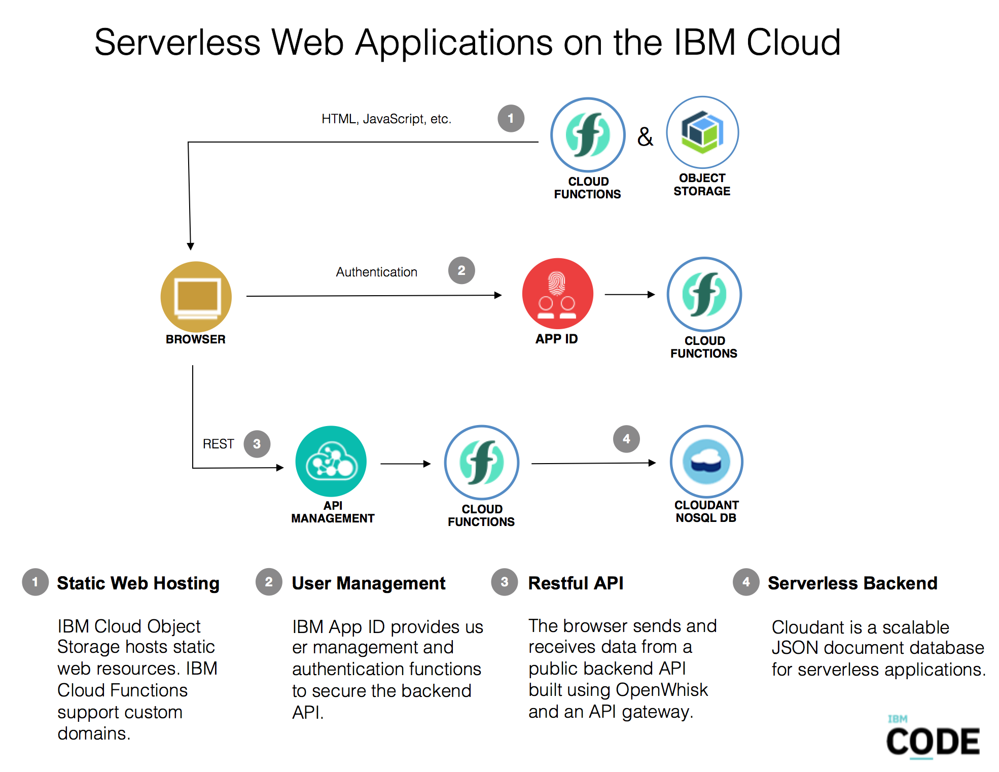

# Serverless Web Applications on the IBM Cloud

This repo explains how to build serverless web applications in the IBM Cloud. Static web resources are stored in IBM Object Storage, business logic is implemented via IBM Cloud Functions, authentication is handled via IBM App ID and data is stored in the managed NoSQL database IBM Cloudant.

The project contains two parts:

1) Sample web application built with Angular which requires user authentication to access data in Cloudant
2) Instructions how to build your own serverless web applications with potentially other JavaScript frameworks and other databases

This diagram shows the architecture with the main components:



Find out more about the main components:

* [IBM Cloud Functions](https://console.ng.bluemix.net/openwhisk) powered by Apache OpenWhisk
* [IBM Cloud Functions API Management](https://console.bluemix.net/openwhisk/apimanagement)
* [IBM Cloud Object Storage](https://console.bluemix.net/catalog/services/cloud-object-storage)
* [IBM App ID](https://console.bluemix.net/catalog/services/appid)
* [IBM Cloudant](https://console.ng.bluemix.net/catalog/services/cloudant-nosql-db)

## Outline

* [Prerequisites](#prerequisites)
* [Local Environment Setup](#local-environment-setup)
* [App ID Setup](#app-id-setup)
* [Cloudant Setup](#cloudant-setup)
* [Cloud Functions Setup for Login](#cloud-functions-setup-for-login)
* Cloud Functions Setup for protected API (to be done)
* [Setup of local Web Application](#setup-of-local-web-application)
* Cloud Object Storage Setup (to be done)
* Custom Domain Setup (to be done)

## Prerequisites

Create an IBM Cloud lite account (free, no credit card required):

* [IBM Cloud account](https://ibm.biz/nheidloff)

Make sure you have the following tools installed:

* [git](https://git-scm.com/downloads)
* [ibmcloud CLI](https://console.bluemix.net/docs/cli/index.html)
* [node](https://nodejs.org/en/download/)
* [curl](https://curl.haxx.se/download.html)
* [ng](https://github.com/angular/angular-cli/wiki)

## Local Environment Setup

Invoke the following commands:

```
$ git clone https://github.com/nheidloff/serverless-web-application-ibm-cloud.git
$ cd serverless-web-application-ibm-cloud
$ ibmcloud login
$ ibmcloud target --cf
$ ibmcloud iam api-key-create serverless-web-application \
  -d "serverless-web-application" \
  --file serverless-web-application.json
$ cp template.local.env local.env
$ cat serverless-web-application.json
```

In [local.env](local.env) define 'IBMCLOUD_API_KEY', 'IBMCLOUD_ORG', 'IBMCLOUD_SPACE' and 'BLUEMIX_REGION' to match the apikey in [serverless-web-application.json](serverless-web-application.json) and the org, space and region name that you're using (see the outputs in your terminal when following the steps above).

## App ID Setup

[App ID](https://console.bluemix.net/catalog/services/appid) is used to authenticate users. 

**Create new App ID service instance:**

Run the following command to create these artifacts:

* App ID service instance 'app-id-serverless'
* App ID Cloud Foundry alias 'app-id-serverless'
* App ID credentials
* App ID test user 'user@demo.email, verysecret'

```
$ scripts/setup-app-id.sh
```

**Reuse an existing App ID service instance:**

The IBM Cloud lite plan only allows one App ID instance in your organization. If you have an App ID instance, you can use it rather than creating a new one. 

In this case copy 'APPID_TENANTID', 'APPID_OAUTHURL', 'APPID_CLIENTID' and 'APPID_SECRET' from your service credentials and paste them in [local.env](local.env).

Additionally create a CF alias so that App ID can be used by Cloud Functions API Management.

```
$ ibmcloud cf services
$ ibmcloud resource service-instances
$ ibmcloud resource service-alias-create app-id-serverless --instance-name app-id-serverless
$ ibmcloud cf services
```

## Cloudant Setup

[IBM Cloudant](https://console.ng.bluemix.net/catalog/services/cloudant-nosql-db) is used to store data used by the web application.

**Create new Cloudant service instance:**

Run the following command to create these artifacts:

* Cloudant service instance 'cloudant-serverless'
* Cloudant database 'serverless'
* Cloudant documents and an index

```
$ scripts/setup-cloudant.sh
```

**Reuse an existing Cloudant service instance:**

The IBM Cloud lite plan only allows one Cloudant instance in your organization. If you have a Cloudant instance, you can use it rather than creating a new one. 

In this case copy 'CLOUDANT_USERNAME' and 'CLOUDANT_PASSWORD' from your service credentials and paste them in [local.env](local.env).

Additionally run this command to create the database and documents:

```
$ scripts/create-cloudant-db.sh
```

## Cloud Functions Setup for Login

Run the following command to create these artifacts:

* Cloud Functions sequence 'serverless-web-app-generic/login-and-redirect'
* Cloud Functions function 'serverless-web-app-generic/login'
* Cloud Functions function 'serverless-web-app-generic/redirect'
* Cloud Function API 'login'
* Redirect URL in App ID

```
$ scripts/setup-login-function.sh
```

## Setup of local Web Application

To run the web application locally run these commands:

```
$ scripts/setup-local-webapp.sh
$ ng serve
```

Open http://localhost:4200 in your browser.

